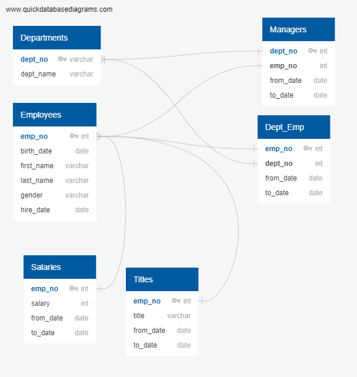

# Pewlett-Hackard-Analysis

For this challenge, Bobby was asked for some more lists in addition to those previously requested by Pewlett-Hackard.

Queries and joins were made using pgAdmin, in PostgreSQL 12, to the PH-EmployeeDB server.

## Part 1

A query was written for 'Number of [titles] Retiring', and the output table was exported to 'num_titles_retiring.csv'. This table joins the employees, titles, and salaries tables. Each observation must satisfy two conditions for inclusion; the employees' birth date being between within 1952-1955, and their hire date being within 1985-1988.

```SQL
SELECT e.emp_no,
	e.first_name,
	e.last_name,
	ti.title,
	ti.from_date,
	s.salary
INTO num_titles_retiring
FROM employees as e
	INNER JOIN titles as ti
		ON (e.emp_no = ti.emp_no)
	INNER JOIN salaries as s
		ON (e.emp_no = s.emp_no)
WHERE (e.birth_date BETWEEN '1952-01-01' AND '1955-12-31')
	AND (e.hire_date BETWEEN '1985-01-01' AND '1988-12-31');
```

A second table, 'titles_retiring_most_recent.csv', was queried and saved. By removing duplicate names from 'num_titles_retiring.csv', this table contains one row per employee, showing their most recent title.

```SQL
-- Only Most Recent Titles
SELECT emp_no, first_name, last_name, from_date, title
INTO titles_retiring_most_recent
FROM
	(SELECT ntr.emp_no, ntr.first_name, ntr.last_name, ntr.from_date, ntr.title, 
	 ROW_NUMBER() OVER 
	(PARTITION BY (ntr.first_name, ntr.last_name) ORDER BY ntr.from_date DESC) num
	FROM num_titles_retiring AS ntr
  ) tmp
WHERE num = 1;
```

A third table, 'count_titles_retiring.csv', shows the count of each title in 'titles_retiring_most_recent.csv'. In theory, this tells each department how many spots will be vacant.

```SQL
-- The table above should have one entry per employee, keeping their most recent title.
-- From here, I need to get a table counting the titles.

SELECT COUNT(*), title
INTO count_titles_retiring
FROM titles_retiring_most_recent
GROUP BY title;
```

'mentor_info.csv' returns promising candidates' full names, title, and date that title was earned, as long as they are still at the company. In the query, this is interpreted as the to_date being '9999-01-01'.

```SQL
-- Who's Ready for a Mentor?
SELECT e.emp_no,
	e.first_name,
	e.last_name,
	ti.title,
	ti.from_date,
	ti.to_date
INTO mentor_info
FROM employees as e
	INNER JOIN titles as ti
		ON (e.emp_no = ti.emp_no)
WHERE (e.birth_date BETWEEN '1965-01-01' AND '1965-12-31')
	 AND (ti.to_date = '9999-01-01');
```

## Part 2

The .PNG below shows an ERD of the PH-EmployeeDB server.


